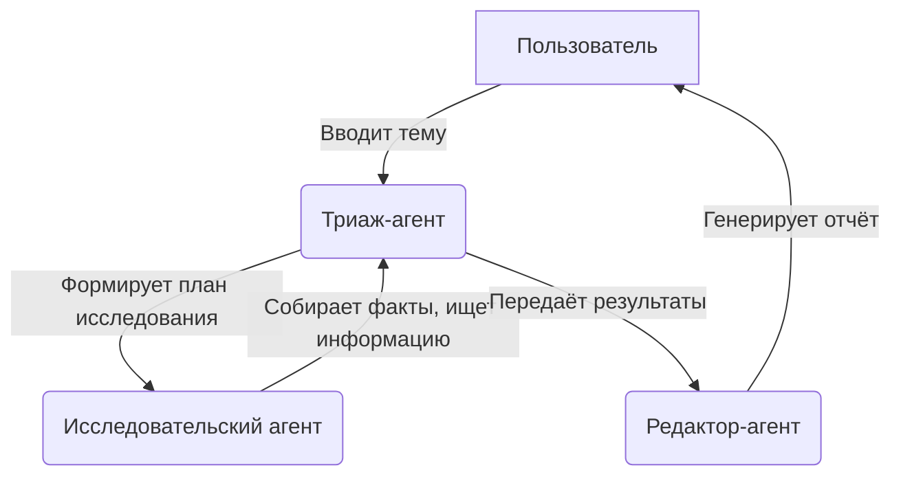
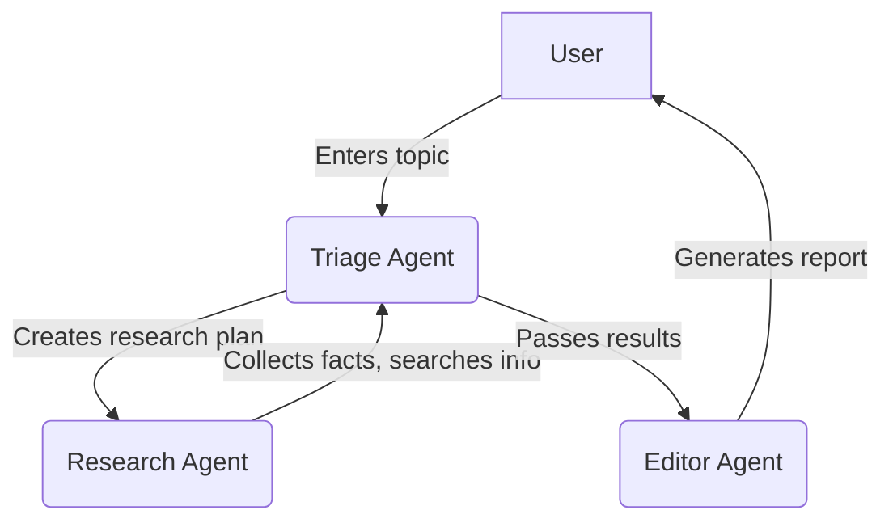

# OpenAI Researcher Agent (Исследователь OpenAI)

## Описание

Интерактивное приложение на Streamlit для проведения исследований и генерации аналитических отчётов с помощью OpenAI Agents SDK. Интерфейс полностью на русском языке, поддерживается ввод OpenAI API ключа через интерфейс.

## Архитектура агентной системы



## Возможности
- Мультиагентная система для сбора и анализа информации
- Генерация подробных отчётов по заданной теме
- Ввод OpenAI API ключа через интерфейс (безопасно, не требуется хранить в .env)
- Полная русификация интерфейса

## Быстрый старт

### 1. Клонируйте репозиторий
```bash
git clone <URL-ВАШЕГО-РЕПОЗИТОРИЯ>
cd openai_research_agent_original
```

### 2. Создайте и активируйте виртуальное окружение
```bash
python3 -m venv venv
source venv/bin/activate
```

### 3. Установите зависимости
```bash
pip install --upgrade pip
pip install -r requirements.txt
```

### 4. Запустите приложение
```bash
python -X utf8=1 -m streamlit run research_agent.py
```

> **Примечание**: Флаг `-X utf8=1` обеспечивает корректную поддержку эмодзи и кириллицы.

### 5. Откройте приложение в браузере
Перейдите по адресу: [http://localhost:8501](http://localhost:8501)

## Использование
1. Введите ваш OpenAI API ключ в сайдбаре.
2. Введите тему для исследования или выберите из примеров.
3. Нажмите "Начать исследование".
4. Дождитесь завершения анализа и скачайте отчёт.

---

# OpenAI Researcher Agent

## Description

Interactive Streamlit app for research and report generation using OpenAI Agents SDK. Russian interface, API key input via UI.

## Agent Architecture



## Features
- Multi-agent system for information gathering and analysis
- Detailed report generation on any topic
- Secure OpenAI API key input via sidebar (no .env required)
- Full Russian localization

## Quick Start

### 1. Clone the repository
```bash
git clone <YOUR-REPO-URL>
cd openai_research_agent_original
```

### 2. Create and activate a virtual environment
```bash
python3 -m venv venv
source venv/bin/activate
```

### 3. Install dependencies
```bash
pip install --upgrade pip
pip install -r requirements.txt
```

### 4. Run the app
```bash
python -X utf8=1 -m streamlit run research_agent.py
```

> **Note**: The `-X utf8=1` flag ensures proper support for emoji and non-ASCII characters.

### 5. Open in browser
Go to: [http://localhost:8501](http://localhost:8501)

## Usage
1. Enter your OpenAI API key in the sidebar.
2. Enter a research topic or select an example.
3. Click "Начать исследование" (Start Research).
4. Wait for the analysis and download the report. 